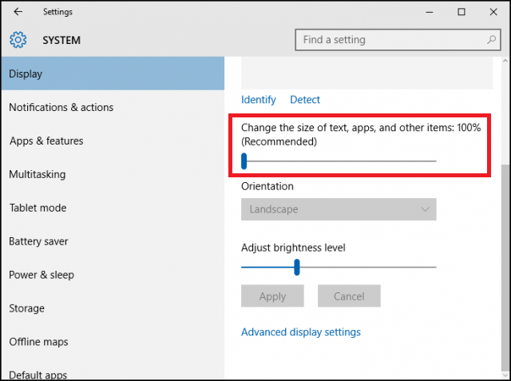

# Screen-portals

## What is it for?

Screen-portals lets you set up walls and pairs of portals on your screen to block and teleport the cursor of your mouse, respectively. Note that this is Windows-only.

### Example #1

In the following examples, all monitors have a resolution of 1920x1080 or 1080x1920 depending on their orientation. It is also assumed that the monitor on the **right** is the main monitor if there are more than one.

The main use of screen-portals is to fix the jerky transition between screens of different pixel densities (ppi/dpi). When transitioning between screens, the mouse will reappear where you expect it to.

To do so, set up a pair of portals as follows in `conf/portals`:

    V -1 0 1080 1.0 0 0 1920 1.0

### Example #2

If the frames of your monitors don't match exactly, you may also want to set up a wall:

In `conf/portals`:

    V -1 337 1080 1.0 0 0 1080 1.0

In `conf/walls`:

    V -1 0 337 1.0

### Example #3

If part of your monitor is out of use, you may want to make sure to avoid visually losing the cursor in the damaged area. Walls can solve that:

In `conf/walls`:

    V 1500 0 600 1.0
    H 1500 600 419 1.0

### Example #4

You can give your screen the topology of a torus thanks to portals:

In `conf/portals`:

    V 1919 0 1080 1.0 0 0 1080 1.0
    H 0 1079 1920 1.0 0 0 1920 1.0

## Usage

To set up portals, change `conf/portals` as follows:

    <direction=H|V> <origin-x-blue> <origin-y-blue> <length-blue> <adjustment-ratio-blue> <origin-x-orange> <origin-y-orange> <length-orange> <adjustment-ratio-orange>
    ...

To set up walls, change `conf/walls` as follows:

    <direction=H|V> <origin-x> <origin-y> <length> <adjustment-ratio>
    ...

Note that if a portal or a wall spans two monitors with different adjustment ratios, you need to split it in two.

**What is adjustment ratio?** Adjustment ratio refers to the following setting in Windows 10. When in doubt, set it to `1.0`.

## Compiling

    cl src\screenportals.cpp user32.lib
